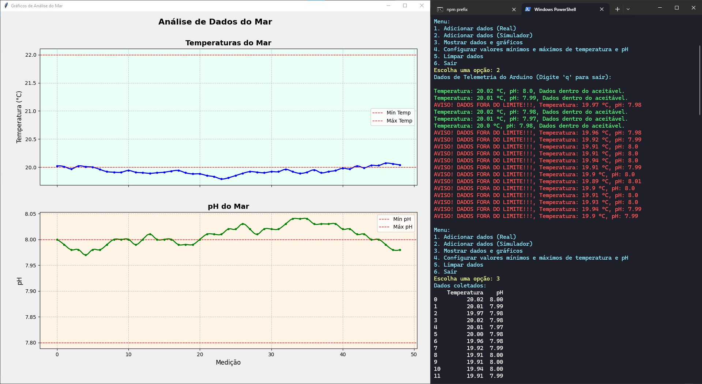

### HydroSense-graph

Bem-vindo ao projeto HydroSense-graph! Este projeto consiste na criação de um software em Python para coletar, armazenar e visualizar informações de pH e temperatura da água usando o dispositivo [HydroSense](https://github.com/Mats057/HydroSense). O objetivo é fornecer uma interface intuitiva para monitorar a qualidade do oceano em tempo real. Para saber mais sobre o projeto e a importância dele, acesse: https://mats057.github.io/HydroSense-Landing/ ou o [repositório do projeto](https://github.com/Mats057/HydroSense) aqui no GitHub.

### Índice

1. [Introdução](#introdução)
2. [Instalação](#instalação)
3. [Uso](#uso)
4. [Configuração](#configuração)
5. [Funcionalidades](#funcionalidades)
6. [Integrantes](#integrantes)

### Introdução

O HydroSense-graph é um software desenvolvido para monitorar a qualidade da água em termos de pH e temperatura. Utilizando o dispositivo [HydroSense](https://mats057.github.io/HydroSense-Landing/), o software coleta dados em tempo real e apresenta essas informações através de gráficos interativos.

### Instalação

Para instalar e configurar o HydroSense-graph, siga os passos abaixo:

1. **Clone o repositório:**
    ```bash
    git clone https://github.com/Mats057/HydroSense-graph.git
    cd HydroSense-graph
    ```

2. **Instale as dependências:**
    ```bash
    pip install -r requirements.txt
    ```
    `Detalhe: Você precisa do pip instalado para executar esse comando!`

### Uso



Para usar o HydroSense-graph, siga os passos abaixo:

1. **Inicie o programa:**
    ```bash
    python main.py
    ```

2. **Menu Principal:**
    No menu principal, você pode escolher entre as seguintes opções:
    - Adicionar dados (Real)
    - Adicionar dados (Simulador)
    - Mostrar dados e gráficos
    - Configurar valores mínimos e máximos de temperatura e pH
    - Limpar dados
    - Sair

3. **Coletar Dados:**
    - Escolha a opção `Adicionar dados (Real)` para iniciar a coleta de dados do dispositivo HydroSense. Os dados serão lidos da porta serial configurada e serão mostrados no terminal se estão dentro da normalidade configurada.
    - Escolha a opção `Adicionar dados (Simulador)` para iniciar a coleta de dados simulados, útil para testes e desenvolvimento.

4. **Mostrar Dados e Gráficos:**
    - Escolha a opção `Mostrar dados e gráficos` para visualizar os dados coletados em gráficos interativos.

5. **Configurar Valores Mínimos e Máximos:**
    - Escolha a opção `Configurar valores mínimos e máximos de temperatura e pH` para definir os limites aceitáveis para a qualidade da água.

6. **Limpar Dados:**
    - Escolha a opção `Limpar dados` para apagar todos os dados coletados.

### Configuração

Para configurar a porta serial e a taxa de transmissão, siga os passos abaixo:

1. **Configurar a porta serial:**
    - Digite o nome da porta serial (por exemplo, COM5 no Windows ou /dev/ttyUSB0 no Linux).

2. **Configurar a taxa de transmissão:**
    - Digite a taxa de transmissão (baud rate) adequada para o dispositivo HydroSense.

### Funcionalidades

- **Coleta de Dados:** Coleta de dados de pH e temperatura da água em tempo real através do dispositivo HydroSense.
- **Simulação de Dados:** Geração de dados simulados para testes e desenvolvimento.
- **Visualização de Dados:** Visualização de dados coletados em gráficos interativos utilizando Matplotlib.
- **Configuração Dinâmica:** Configuração dinâmica dos limites aceitáveis para temperatura e pH.

### Integrantes

- [**Matheus Queiroz**](https://www.linkedin.com/in/matheus-zanutin/) - RM558801 
- [**Matheus Vinícius**](https://www.linkedin.com/in/matheus-alves-8471942b1/) - RM555177
- [**Marcela Torro**](https://www.linkedin.com/in/marcela-torro-b98a50237/) - RM557658

